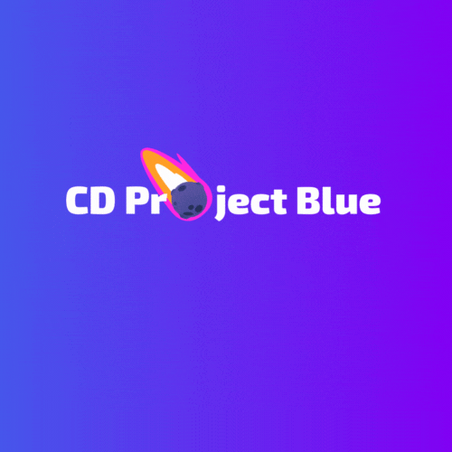

## About The Project

Frontend repository from IO 2023 class at AGH UST.

### Built With

- React
- Tailwind CSS

### Definition Of Done

- Implemented
- Reviewed
- Meets Acceptance Criteria
- Merged to development branch (with rebase)
- Discussed with PO

## Getting Started

To get a local copy up and running follow these simple example steps.

- Clone the repo
    ```sh
    git clone https://github.com/projektI0/io-frontend
    ```
- Setup application, you can choose [basic usage](#basic-usage) or
  [development usage](#development-usage)

### Basic Usage

1. Run docker container
    ```sh
    docker-compose up
    ```
2. Open localhost at port 5173

### Development Usage

1. Install NPM packages
    ```sh
    npm install
    ```
2. Start Vite
    ```sh
    npm run dev
    ```
3. Build Tailwind CSS (if you have changed styles)
    ```sh
    npm run build-css // build once
    npm run build-css-on-each-save // build after every change
    ```
4. Open localhost at port 5173
